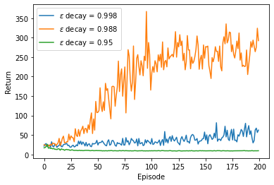

# Deep Q Learning (DQN) for Gymnasium's CartPole task

Model-free, off-policy, Q-learning reinforcement learning (ICL).

Implemented an agent that balances the cart pole for as long as possible.

### Methods
- DQN
- Epsilon-greedy exploration policy
- DDQN (to avoid action overestimation)
- Epsilon schedule decaying
- Isolated hyperparameter tuning

### Impact of different epsilon decay speeds on task performance
